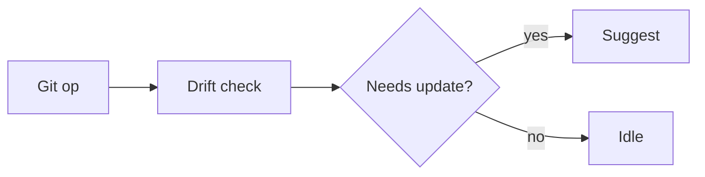

# Diagramming

When to add a diagram and how to keep it maintainable.

## When to diagram
- When relationships between 3+ components are hard to follow in prose.
- When a reader needs a map before reading details.
- When the system has a lifecycle or state machine worth showing at a glance.

Do not diagram what a single sentence already conveys. Do not diagram for decoration.

## Formats
- Prefer Mermaid fenced blocks for flowcharts, sequence diagrams, and state machines. They render in most markdown viewers and are diff-friendly.
- Use an inline ASCII sketch only for tiny, throwaway illustrations.
- For richer diagrams, link to a maintained source file rather than pasting a PNG.

## Mermaid examples

## Rules
- One diagram per concept. Keep it legible at a default zoom.
- Label every node with a name a reader can map to the prose.
- Keep diagrams in sync with the surrounding text. If the text changes, update the diagram in the same change.
- Prefer direction (left-to-right, top-to-bottom) that matches how the reader reads the page.
